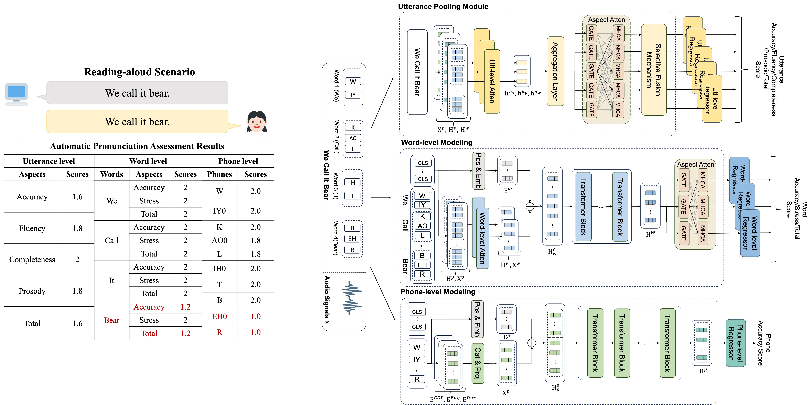

An Effective Pronunciation Assessment Approach Leveraging Hierarchical Transformers and Pre-training Strategies
============
##  HierTFR :girl: :computer:
This is the source code of the paper ["An Effective Pronunciation Assessment Approach Leveraging Hierarchical Transformers and Pre-training Strategies"](https://aclanthology.org/2024.acl-long.95.pdf). 

The paper has been accepted in ACL 2024, Bangkok, Thailand :elephant::elephant:.

This work first introduces HierTFR, a hierarchal APA method that jointly models the intrinsic structures of an utterance while considering the relatedness among the pronunciation aspects. We also propose a correlation-aware regularizer to strengthen the connection between the estimated scores and the human annotations. Furthermore, novel pre-training strategies tailored for different linguistic levels are put forward so as to facilitate better model initialization.
> The development of our code is based on GOPT, an open-source project available at [https://github.com/YuanGongND/gopt](https://github.com/YuanGongND/gopt) (Gong et al, 2022).

> We also employ the ESPent (end-to-end speech processing toolkit) to implement the aspect attention mechanism, where the ESPnet is an open-source project available at [https://github.com/espnet/espnet] (Watanabe et al, 2018).

<p align="center"></p>

## Dataset
An open source dataset, SpeechOcean762 (licenced with CC BY 4.0) is used. Please refer to the project at [[https://www.openslr.org/101](https://github.com/jimbozhang/speechocean762)https://github.com/jimbozhang/speechocean762].

## Package Requirements
Install the below packages in your virtual environment before running the code.
- python==3.7.12 
- pytorch==1.13.1+cu117
- numpy==1.21.2
- pandas==1.2.2
- espnet==202402

## Pretraining Stage
- `cd src`
- `bash run_preTrain.sh`

## Training and Evaluation
This bash script will load the pre-trained model and train the model 5 times with epoch ([0, 1, 2, 3, 4]).
- `cd src`
- `bash run.sh`

Note that every run does not produce the same results due to the random elements.

## Citing
We would appreciate you citing our paper if you find this repository useful.
```
@inproceedings{yan-etal-2024-effective,
    title = "An Effective Pronunciation Assessment Approach Leveraging Hierarchical Transformers and Pre-training Strategies",
    author = "Yan, Bi-Cheng  and
      Li, Jiun-Ting  and
      Wang, Yi-Cheng  and
      Wang, Hsin Wei  and
      Lo, Tien-Hong  and
      Hsu, Yung-Chang  and
      Chao, Wei-Cheng  and
      Chen, Berlin",
    booktitle = "Proceedings of the 62nd Annual Meeting of the Association for Computational Linguistics (Volume 1: Long Papers)",
    year = "2024",
    pages = "1737--1747",
}

```
## Contact
If you have any questions, please raise an issue (preferred) or send an email to me at bicheng@ntnu.edu.tw, or to the second author, J.-T. Lee, at 60947036s@ntnu.edu.tw.

